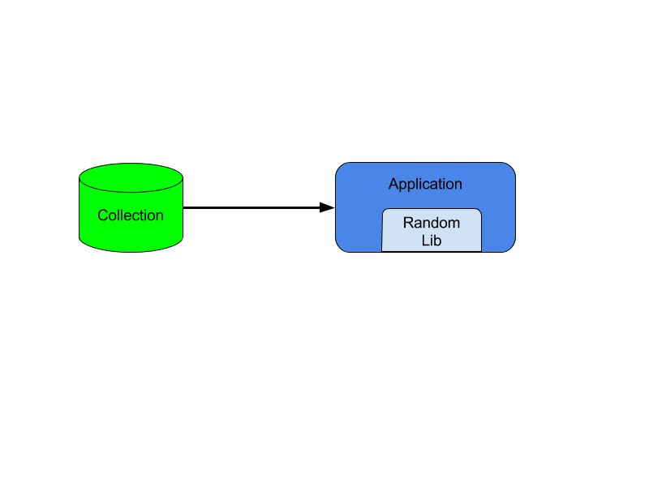

# How to Perform Random Queries on MongoDB

As part of my day-to-day tasks I sometimes have the need to run some random queries on datasets. May it be for getting some nice example to work on a random set or just to get a list of randomly picked MUG members for a quick raffle or swag winner


To do this in using MongoDB (obviously I'm going to use MongoDB for the task!) we have several different approaches to fulfill such task.

## The traditional approach

Not long ago, to raffle some conference tickets at one of the MongoDB User Groups, I've invited all members to come up with an implementation on how to get a random document from MongoDB.
I was hopping for highly efficient approach that would involve changing MongoDB kernel and implementing some specific feature on MongoDB itself but that was not the idea our MUG members.
All proposed algorithms where client based.
By client based I mean that all the randomization phase of the algorithm was performed on the client side.
The algorithms would be based on the client random libraries and would consist of the following approach:

- get data from MongoDB
- run it through a random library
- spill out a winner


A simple example for this type of approach can be the following:
```python
def load_data(collection, n=100):
    for i,d in load_data_file(n):
        collection.insert( d )

def get_data(collection, query={}):
    for d in collection.find(query):
        yield d

elements = []
for e in get_data(collection):
    elements.append(e)

idx = random.randint(0, len(elements))

print "AND THE WINNER IS ..... " + elements[idx]['name']
```

A slightly better approach here would be to just filter the data that I want show back to the user by using [mongodb filter](mongofilter)

```python
def get_data(collection, query={}, filter={}):
    for d in collection.find(query, filter):
        yield d
for e in get_data(collection, {'name':1, '_id':0}):
  ...

```

## Adding a bit of salt ...

Although the previous approach can be slightly improved by adding filters and even dedicated (or already used) indexes they are client bound. If we have 1M records (MongoDB User groups are quite popular!) iterating over that amount of documents becomes a burden on the application and we are not really using any of MongoDB magic to help us complete our task.

### Adding an incremental value

A typical approach would be to `mark` our documents with a value that we would then use to randomly pick elements from.

We can start by setting an incremental value to our documents and then query based on the range of values that we recently `marked` the documents with
```python
def load_data(collection, n=100):
    #for each element we will insert the `i` value
    for i in xrange(n):
        name = ''.join(random.sample( string.letters, 20))
        collection.insert( {'name': name, 'i': i})
```

After `tatooing` our documents with this new element we are now able to use some of the magic of MongoDB query language to start collecting our well deserved prize winner.

```python
mc = MongoClient()
db = mc.simplerandom
collection = db.names

number_of_documents = 100

load_data(collection, number_of_documents )

query = {'i': random.randint(0, number_of_documents )  }

winner = collection.find_one(query);

print "AND THE WINNER IS ..... " + winner['name']
```
While this approach seems fine and dandy there are a few problems here:
- we need to know the number of documents inserted
- we need to make sure that all data is available

### double trip to mother ship

To attend the first concern `we need to know the number of documents inserted` we can count with the MongoDB [count operator](mongodbcount).  
```python
number_of_documents = collection.count()
```
This operator will immediately tell us the number of elements that a given collection contains

But it does not solve all of our problems. We are still not sure if all the data would be available (you might not know this but MongoDB allows data to be removed from time to time!) and if we have several different clients inserting data into our collection _how can we know if they are following the correct increment to the last inserted element ?_

We need to know the __higher__ value of _i_ since that might differ from the `count` of documents in the collection and we need to attend for any eventual skip of the value of _i_ (deleted document, incorrect client increment)
For accomplishing this in a truly correct way we would need to use `distinct` to make sure we are not missing any values and then querying for a document that would contain such a value.
```python
def load_data(collection, n=100):
    #let's skip some elements
    skiplist = [10, 12, 231 , 2 , 4]
    for i,d in load_data_file(n):
        d['i'] = i
        if i in skiplist:
            continue
        collection.insert( d )

load_data(colletion, 100)

distinct = collection.distinct('i')

ivalue = random.sample(distinct, 1)

winner = collection.find_one({ 'i': ivalue })

print "AND THE WINNER IS ..... " + winner['name']
```

Although we are starting to use MongoDB magic to give us some element of randomness this is not truly a good solution.
- Requires multiple trips to the database
- Becomes computational bound on the client (again)
- very prone to errors while data is being used

### making more of the same tatoo

To avoid a large computationaly bound on the client due to the high number of distinct `i` values another approach would be to use a limited amount of `i` elements to `mark` our documents and randomize the occurence of this `mark`:
```python
def load_data(collection, n=100):
    #fixed number of marks
    max_i = 10
    for j,d in load_data_file(n):
        d['i'] = random.randint(0, max_i)
        collection.insert( d )
```

This way we are limiting the variation of the `i` value and limiting the computational task on both the client and on MongoDB:
```python
number_of_documents = 100

load_data(collection, number_of_documents )

query = {'i': random.randint(0, 10 )  }

docs = [x for x in collection.find(query)]

winner = random.sample(docs, 1)[0]

print "AND THE WINNER IS ..... " + winner['name']
```


### 2d indexes for more than just charting maps

MongoDB also comes featured with 2d indexes and 2dshpere indexes. While one may think that the 2d indexes are the geospatial poor man's solution and the 2dsphere it's more accurate and elegant cousin, this is not exactly correct.
2d indexes allows us to perform calculations on a plane. This means that if you have to discrete set of values and want to correlate distances and approximations you can do that using such indexes.

So instead of just simply inserting an incremental or even a random value we can use this functionality to calculate proximity on a plane:
```python
def load_data(collection, n=100):
    #2d indexes FTW
    max_x = 180
    max_y = 180
    for j, d in load_data_file(n):
        d['rand'] = [random.randint(-max_x, max_x), random.randint(-max_y, max_y)]
        collection.insert( d )
    collection.create_index( [('rand', '2d')])
```

Then we just need to make use of [`$near`](nearoperator) given a 2 point random generated values:
```python
number_of_documents = 100

load_data(collection, number_of_documents )

x = random.randint(-180, 180)
y = random.randint( -180, 180)

query = {'rand': {'$near': [x, y]}}

winner = collection.find_one(query)

print "AND THE WINNER IS ..... " + winner['name']
```


## ... but then again, we have a better solution!

The above implementations, no matter how _magical_ they might be, more or less simplistic, multiple or single trips to the database ... they tend to:
- be inefficient
- create artificial workarounds on data
- the random implementation is always bound to the client
- are not natively / pure MongoDB implementations

But fear not! Our [upcoming 3.2 release](3.2release) brings a solution to this simple wished task: __[$sample](samplelink)__

$sample is a new aggregation framework operator that implements a true random sample over a collection data set:
- no more playing with extra fields and extra indexes
- no more double trips to the database to get your documents
- native, optimized, internal sampling operator over your _immaculate_ documents:

```python
number_of_documents = 100

load_data(collection, number_of_documents)

winner = [ d for d in collection.aggregate([{'$sample': {'size': 1 }}])][0]

print "AND THE WINNER IS ..... " + winner['name']
```

Just beautiful!

[samplelink]: http://docs.mongodb.org/reference/operator/aggregation/sample
[mongodbcount]: http://docs.mongodb.org/reference/method/cursor#count
[3.2release]: http://docs.mongodb.org/release-notes/3.2
